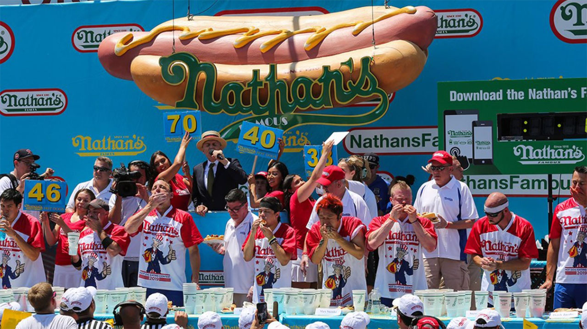

```{r setup, include=FALSE}
knitr::opts_chunk$set(echo = TRUE)
```

# Hot Dog Eating Contest

```{r img1, echo = FALSE, out.width = "100%"}
    
```


## The Data

We will be using hotdog eating contest dataset 

Firstly, we need to load the tidyverse package and hotdog eating contest dataset

```{r}
hotdogs <- read.csv("./hotdogs.csv")
pacman::p_load(tidyverse)

#There is an error in the variable name of the original data
colnames(hotdogs)[1] <- "Year"
```

Then we need to do some basic exploration of the dataset

```{r}
#Shows structure of hotdogs dataset
str(hotdogs)

#Shows the first 6 data of the hotdogs dataset
head(hotdogs)

#Look at summary of the data
summary(hotdogs)
```

In this dataset, each row is a separate contestant. It contains the data of 380 contestant from the year 2002 to 2019 in terms of Name, type of contest, ID of player and performance characteristics. Among the 16 variables in the dataset, there are num variables such as rate of eating hotdogs and number of hotdogs eaten, int variables, such as year and dataset rank, and character variables, such as name.

We also realize the duration of the contest in the first couple of years are 12 minutes. Starting from 2008, the duration becomes 10 minutes. Due to this change in contest duration, when we compare the performance of contestants across years, we compare their hot dog eating rate.

## Research Questions

*First Research Question:*

Is sex a inherent factor that affects hotdogs consumption? To be more specific, is it often that there is a difference between male and female sex groups from the 2002 competition to 2019 in terms of both the highest number of hotdog consumption and average hotdog eating rate?

*Second Research Question:*

What is the performance trajectory of the contestants who participate more than 10 hotdog eating contests in terms of both the rate they eat hotdogs and their percentiles in their competitions?


## Side-by-Side Comparison of Men's and Women's Competition

We compare male and female competitions in terms of both their distribution with boxplots and average and extreme values with line graph.


### Distribution with Boxplot (Mixed/Unmixed)

```{r}
#Divide data into groups of mixed and unmixed data
mixed_data <- hotdogs %>% filter(Contest == "Mixed")
other_data <- hotdogs %>% filter(Contest != "Mixed")

#Generate box plot for visualizing distribution changes between each year. 
#Use jitter for a more complete exhibition of the data.
#Firstly visualize the mixed data
ggplot(mixed_data, aes(x = Sex, y = Rate..hot.dogs...min., color = Sex)) + 
  geom_boxplot() + 
  geom_jitter(alpha = 0.5) +
  #By using facetting distributions can be compared within different years.
  facet_grid(Year~.) + 
  coord_flip() + 
  ylab("Rate: hotdogs/min") + 
  xlab(element_blank()) + 
  labs(title = "Mixed Contest Distributions")
```

```{r}
#Use same way for visualization of unmixed data
ggplot(other_data, aes(x = Sex, y = Rate..hot.dogs...min., color = Sex)) + 
  geom_boxplot() + 
  geom_jitter(alpha = 0.5) + 
  facet_grid(Year~.) + 
  coord_flip() +
  ylab("Rate: hotdogs/min") + 
  xlab(element_blank()) + 
  labs(title = "Unmixed Contest Distributions")
```


From 2002-2010, the contest were mixed and the competitions after 2011 are divided into male and female contest group. In years of 2002, 2003 and 2006, there aren’t many contestants and data. 

For the mixed contests, the range of hotdogs eating rate for male is way larger than females and the contest has way more male participants than females. Females performed on average better than males (probably because only those females that are very good at eating hotdogs tend to join the contest), and the winner in terms hotdogs eating rate were mostly males. 

In the following years of unmixed contest, average females performance declined. A likely cause of this trend is more females who are not super good at eating hotdogs also join the competition because they don't have to compete with male anymore. More female participants of this competition also corroborates with this speculation. Another observation of the data is as more contests are hold, the range of hotdogs eating rate for male decreased and was getting closer to female. This is probably because there are more and more participants of this contest each year and a bigger sample tend to have fewer extreme values, making the data less spread out.


### Average and Extreme Values with Line graph

```{r}
#For data analysis we would modify the data first
#Generate data frame for averages
d1 <- hotdogs %>% 
  group_by(Sex, Year) %>% 
  summarise(n = mean(Rate..hot.dogs...min.))
#Mark the status of the data
d1$stat <- ifelse(d1$Sex == "F",
                  "Female Average",
                  "Male Average")

#Generate dataframe for maximum
d2 <- hotdogs %>% 
  group_by(Sex, Year) %>% 
  summarise(n = max(Rate..hot.dogs...min.))
d2$stat <- ifelse(d2$Sex == "F",
                  "Female Max",
                  "Male Max")

#Bind the two dataframes
max_avg_data <- rbind(d1, d2)

#Then we would want to visualize the data by forming a line plot
ggplot(max_avg_data, aes(x = Year, y = n, color = stat)) + 
  geom_line() + 
  ylim(0,8) + 
  labs(title = "Male vs. Female Average and Maximum",
       y = "Hotdog Eating Rate") +
  theme(legend.position = "bottom",
        legend.title = element_blank())
```

The maximum values of hotdog eating rate for males in contests are constantly higher than the maximum for female, and the maximum values for male increase faster than female throughout 2002 to 2019. The maximum values of hotdog eating rate for female only increases before 2012 and it remains constant after a small decreases from the value it hit in 2012. 

By average, the hotdogs eating rate for males are approximately the same as females' before 2010. Since then, male's average eating rate and female's started diverging. This phenomenon could be caused by unmixed contests. During the time when only mix contests are hold, female must try to stay close with male and only the female who feels super confident in terms of eating hotdogs join the contest. When female only need to compete with their own sex, they have less pressure of eating, and more average level contestants want to try out this contest.


## Performance Trajectory of Participants

We follow the performance trajectory of the contestants who participate this competition over 10 times from 2002 to 2019. We will analyze their performance both in terms of their hot dog eating rate and their percentiles in the competition of the year. Their hotdog eating speed shows the trajectory of their skill. The percentiles trajectory shows how well they compete to others, especially after 2010 when the contest started having sex group. 

### Performance Trajectory in terms of Rate

```{r}
# Only keep the observations that have number of competitions above 10. 
data_filtered <- filter(hotdogs, Total.Number.of.NFHDEC.Competitions > 10)
# Put the observations that have the same last name in groups.
data_filtered %>% group_by(Last.Name)
data_arranged <- arrange(data_filtered, Last.Name)
# Visualizing data by having years be x and rate of eating hotdogs be y. 
# Colors are used to represent each contestants we observe.
ggplot(data = data_arranged, mapping = aes(x = Year, y = Rate..hot.dogs...min., 
color = Last.Name)) +
    geom_point() +
    geom_smooth() +
# Each contestant gets his own graph and the whole distribution is more organized
    facet_wrap(~ Last.Name, nrow = 2) +
  labs(title = "Performance Trajectory (Rate)",
       x = "Years",
       y = "Rate of Eating Hotdogs") +
  theme(legend.position = "bottom",
        legend.title = element_blank())
```
These figures show the performance trajectories of five contestants we observe. Overall speaking, except for Chestnut who improves a lot from 2005 to 2019, the performances of other contestants are relatively steady. Chestnut definitely wins the most improving award as his performance improves from about 3 hotdogs per minutes to 7 from 2005 to 2019. Booker's performance are relatively steady since he first entered this competition in 2002. Lee, Denmark, and Thomas's performance trajectories are similar. Their performances all improve until 2010 and start declining mildly since then. 

### Performance Trajectory in terms of Percentile

```{r}
# Add two columns which describe number of participants by sex and total participants.
Participants_numbysex <- hotdogs %>% 
  count(Year, Sex, name = "NumberbySex")

Participants_num <- hotdogs %>% 
  count(Year, name = "TNumber")

hotdogs <- Participants_numbysex %>% 
  select(Year, NumberbySex) %>% 
  right_join(hotdogs, by = c("Year")) 

hotdogs <- Participants_num %>% 
  right_join(hotdogs, by = c("Year"))

# Calculate percentile by 1-(contest place/the number of contestants in the competition).
# Firstly, we mutate by adding the column percentile
PercentTraj <- hotdogs %>% 
  mutate(percentile = case_when(Year <= 2010 ~ 1-(Contest.Place/TNumber),
                                Year >2010 ~ 1-(Contest.Place/NumberbySex))) %>%
# Only observe contestant who participates 10 more contests
  filter(Total.Number.of.NFHDEC.Competitions > 10) %>% 
# Visualizing data by having years be x and percentile in a contest be y. 
# Colors are used to represent each contestants we observe.
  ggplot(mapping = aes(x = Year, y = percentile, color = Last.Name)) +
    geom_point() +
    geom_smooth() +
# Each contestant gets his own graph and the whole distribution is more organized
    facet_wrap(~ Last.Name, nrow = 2) +
  labs(title = "Performance Trajectory (Percentile)",
       x = "Years",
       y = "Percentile") +
  theme(legend.position = "bottom",
        legend.title = element_blank())

PercentTraj
```

These graphs show how well the five contestant we observe compete to others in their contests. First we have to acknowledge Chestnut, his percentiles are almost always above 90% after he participates this contest for a couple of times. 

From Booker and Denmark's percentile trajectory, we observe a drop since 2010 when these two males have to compete within their own sex group. Male do tend to eat more than female so this drop in their percentile trajectory could be explained by they lose advantage by not having females in their competition group anymore. 

Lee and Thomas are female and although their rate of eating hotdogs start decreasing since 2010, their percentiles are actually increasing. This could also due to they do not have to compete with male who naturally tend to eat more than them. This may also explain why their rates of eating hotdogs decreases since they don't have to eat as much and can still do quite well in the contest.

## Answers to Research Questions and Summary

*Research Question 1:*

We have good reason to believe sex is an inherent factor that affects hotdog eating rate. Although before 2010, the average hot dog eating rate for female is about the same as male, after more participants join the contests since 2011 (larger sample), the average hot dog eating rate for female had never been higher than male. The previous, close average eating rate can be explained by the only females who joins the competition are the ones who believe they can compete with male in terms of eating. From the perspective of the maximum value, from 2002 competition to 2019, it is always a male who has the highest rate of eating hotdogs.

*Research Question 2:*

Among the five contestants we observe, Chestnut has the strongest skill. His hotdog eating rate improves so fast and stay the highest amoung the five contestants we observe. His percentiles are almost alwasy above 90%. The two female contestants we observe, Lee and Thomas, since 2010, their hotdog eating rate drops but their percentile increases, which is likely due to they only compete to female. The two male contestants we observe experience the exact opposite. Their hotdogs eating rates are relatively steady but their percentile drops after 2010, which could be caused by they have to compete within their own sex group.